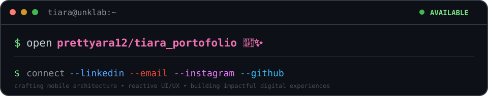

<!-- Cyber-Pink Animated Hero Banner -->
<p align="center">
  
</p>

<!-- Live Typing Animation & Character Showcase -->
<div align="center">
  

  <br /><br />

  <a href="https://github.com/prettyara12">
    
  </a>

  <br /><br />

  &nbsp;
  &nbsp;
  &nbsp;
  
</div>

<br />

<!-- About Me Section -->
<h2> &nbsp;Developer Architecture</h2>

```typescript
const tiara: MobileArchitect = {
  name: "Tiara Mamuaya",
  role: "Mobile Application Developer & Informatics Student",
  institution: "Universitas Klabat (UNKLAB) [2023 — 2027]",
  faculty: "Fakultas Ilmu Komputer (FIK)",
  program: "Informatika / Computer Science",
  location: "Airmadidi, North Sulawesi 🇮🇩",
  focus: "High-performance cross-platform mobile engineering & reactive UX",
  specialties: {
    mobile: ["React Native", "Expo Go", "Cross-Platform UI/UX", "Mobile State Management"],
    frontend: ["TypeScript", "JavaScript (ES6+)", "Vite", "Modern CSS / Tailwind"],
    backend: ["Python (Flask)", "Supabase", "PostgreSQL", "RESTful APIs"],
    tools: ["Git & GitHub", "Figma", "VS Code", "Postman"],
  },
  motto: "Transforming creative ideas into elegant, pixel-perfect digital experiences",
};
```

<h2> &nbsp;Tools of the Trade</h2>

<p align="center">
  
</p>

<h2> &nbsp;GitHub Activity &amp; Telemetry</h2>

<p align="center">
  <br/>
  
  
</p>

<h2> &nbsp;Let's Connect</h2>

<p align="center">
  <a href="https://github.com/prettyara12/tiara_portofolio"></a>
</p>

<p align="center">
  <a href="https://github.com/prettyara12/tiara_portofolio" target="_blank"></a>&nbsp;&nbsp;
  <a href="https://linkedin.com/in/tiaramamuaya" target="_blank"></a>&nbsp;&nbsp;
  <a href="https://instagram.com/tiaramamuaya" target="_blank"></a>&nbsp;&nbsp;
  <a href="mailto:tiaramamuaya@gmail.com"></a>&nbsp;&nbsp;
  <a href="https://github.com/prettyara12"></a>
</p>

<p align="center"><sub>crafting mobile architecture • reactive UI/UX • building impactful digital experiences</sub></p>
